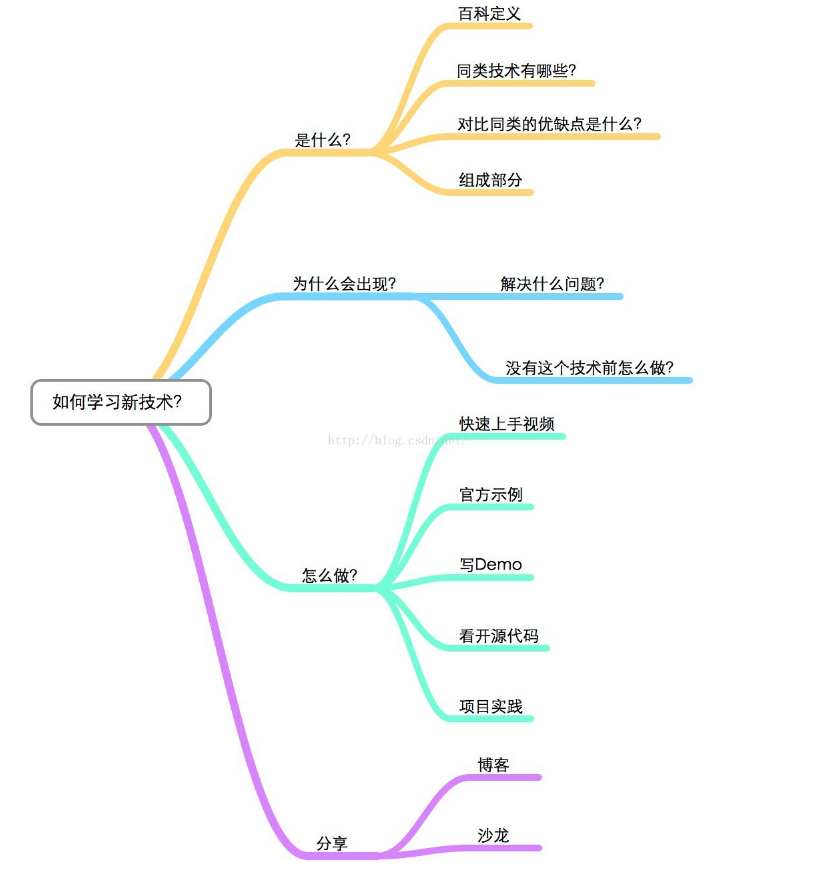

### WebSocket
> *提出正确的问题，往往等于解决了问题的大半。——海森堡*




- #####  百科定义
    
    WebSocket协议是基于TCP的一种新的网络协议。它实现了浏览器与服务器全双工(full-duplex)通信——允许服务器主动发送信息给客户端。WebSocket通信协议于2011年被IETF定为标准RFC 6455，并被RFC7936所补充规范。

- ##### 同类技术

    Http协议。
- ##### 对比同类的优缺点

    *  优点：
       
       对于http协议有长连接和短连接，短连接并且要实现三次握手，长连接要在一定时间内保持连接，并且http的head占用的字节比较大，传输速度慢，数据包大，如实时交互，服务器性能压力大，数据传输安全性差。而websocket传输数据为`字节级`，传输数据可自定义，`数据量小`对于手机应用讲：费用低），传输数据时间短，性能高，适合于客户端和服务器端之间信息实时交互，可以加密,数据安全性强。
       
    *  缺点：
        
        需对传输的数据进行解析，转化成应用级的数据;对开发人员的开发水平要求高;相对于Http协议传输，增加了`开发量`
- ##### 组成部分

    客户端，服务端。
- ##### 解决什么问题
    
    WebSocket支持推送服务，而http协议服务端永远是被动的，解决了http无法实现了服务端与客户端的实时交互。WebSocket的请求信息很短，而http协议的请求头head数据包很大，占用多余的带宽，降低服务端的性能压力。
- ##### 没有这个技术前怎么做的

    *   Polling（轮询）
    
        >   这种方式就是通过Browser/UA定时的向Web服务器发送http的Get请求，服务器收到请求后，就把最新的数据发回给客户端（Browser/UA），Browser/UA得到数据后，就将其显示出来，然后再定期的重复这一过程。虽然这样可以满足需求，但是也仍然存在一些问题，例如在某段时间内Web服务器端没有更新的数据，但是Browser/UA仍然需要定时的发送Get请求过来询问，那么Web服务器就把以前的老数据再传送过来，Browser/UA把这些没有变化的数据再显示出来，这样显然既浪费了`网络带宽`，又浪费了CPU的利用率。如果说把Browser发送Get请求的周期调大一些，就可以缓解这一问题，但是如果在Web服务器端的数据更新很快时，这样又不能保证Web应用程序获取数据的实时性。
    
    *   Long Polling 
    
        >上面介绍了Polling遇到的问题，现在介绍一下LongPolling，它是对Polling的一种改进。
Browser/UA发送Get请求到Web服务器，这时Web服务器可以做两件事情，第一，如果服务器端有新的数据需要传送，就立即把数据发回给Browser/UA，Browser/UA收到数据后，立即再发送Get请求给Web Server；第二，如果服务器端没有新的数据需要发送，这里与Polling方法不同的是，服务器不是立即发送回应给Browser/UA，而是把这个请求保持住，等待有新的数据到来时，再来响应这个请求；当然了，如果服务器的数据长期没有更新，一段时间后，这个Get请求就会超时，Browser/UA收到超时消息后，再立即发送一个新的Get请求给服务器。然后依次循环这个过程。
这种方式虽然在某种程度上减小了网络带宽和CPU利用率等问题，但是仍然存在缺陷，例如假设服务器端的数据更新速率较快，服务器在传送一个数据包给Browser后必须等待Browser的下一个Get请求到来，才能传递第二个更新的数据包给Browser，那么这样的话，Browser显示实时数据最快的时间为2×RTT（往返时间），另外在网络拥塞的情况下，这个应该是不能让用户接受的。另外，由于http数据包的头部数据量往往很大（通常有400多个字节），但是真正被服务器需要的数据却很少（有时只有10个字节左右），这样的数据包在网络上周期性的传输，难免对网络带宽是一种浪费。
        
- ##### 官方示例

    [WebSocket-Web APIS](https://developer.mozilla.org/zh-CN/docs/Web/API/WebSocket)    
    [WebSocket Client API](http://www.eclipse.org/jetty/documentation/current/jetty-websocket-client-api.html)    
   

- ####  Demo
    *   Js客户端代码
        ```javascript
        var webSocket = new WebSocket('ws://localhost:8080/em/chat');

		webSocket.onerror = function(event) {
			onError(event)
		};

		webSocket.onopen = function(event) {
			onOpen(event)
		};
        //实时监听服务端反馈的信息
		webSocket.onmessage = function(event) {
			onMessage(event)
		};

		function onMessage(event) {
			document.getElementById('messages').innerHTML 
				+= '<br />' + event.data;
		}

		function onOpen(event) {
			document.getElementById('messages').innerHTML 
				= 'Connection established';
			var text =document.getElementById('text').value;
			//想服务端传送数据
			webSocket.send(text);
		}

		function onError(event) {
			console.info(event.data);
		}
		```
    *   Java客户端代码
        ```java
       
        @WebSocket(maxBinaryMessageSize = 60 * 1024)
        public class SimpleSocket
        {
            private final CountDownLatch closeLatch;
            @SuppressWarnings("unused")
            private Session session;
        
            private Map map = new HashMap<String,String>(16);
        
        
            public SimpleSocket()
            {
                this.closeLatch = new CountDownLatch(1);
            }
        
            public boolean awaitClose(int duration, TimeUnit unit) throws InterruptedException
            {
                return this.closeLatch.await(duration,unit);
            }
        
            @OnWebSocketClose
            public void onClose(int statusCode, String reason)
            {
                System.out.printf("Connection closed: %d - %s%n",statusCode,reason);
                this.session = null;
                this.closeLatch.countDown(); // trigger latch
            }
        
            @OnWebSocketConnect
            public void onConnect(Session session)
            {
                System.out.printf("Got connect: %s%n",session);
                this.session = session;
                try
                {
                    Future<Void> fut;
        
                    //向服务端传送指令
                    map.put("ACTION","REMIND");
        
                    JSONObject dataJson=new JSONObject(map);
        
                    fut = session.getRemote().sendStringByFuture(dataJson.toString());
        
                    fut.get(2,TimeUnit.SECONDS); // wait for send to complete.
        
                    session.close(StatusCode.NORMAL,"I'm done");
                }
                catch (Throwable t)
                {
                    t.printStackTrace();
                }
            }
        
            @OnWebSocketMessage
            public void onMessage(String msg)
            {
                //接受服务端接受的json字符串
                JSONObject dataJson=new JSONObject(msg);
        
                //判断指令
                if ("REMIND".equals(dataJson.get("ACTION"))) {
        
                    //// TODO: 2017/11/20
                }else{
        
                    //// TODO: 2017/11/20
                }
        
            }
        }
        ```
        `注：java客户端代码使用环境适为Jdk8`
        
    *   服务端代码
    
        ```java
        @ServerEndpoint("/api")
        public class WebSocketTestChat {
            Set<Session> session_list =null;
        	@OnMessage
            public void onMessage(String message, Session session) 
            	throws IOException, InterruptedException {
        
                JSONObject dataJson=new JSONObject(message);
        
                String action = (String) dataJson.get("ACTION");
                if(action.equals("REMIND")){
                    //// TODO: 2017/11/20
        
                }else{
                    //// TODO: 2017/11/20
                }
                session_list =session.getOpenSessions();
                for(Session s:session_list){
                    s.getBasicRemote().sendText(dataJson.toString());
                }
            }
        	@OnOpen
            public void onOpen () {
            }
        
            @OnClose
            public void onClose () {
            }
        }
        ```
         
       
		
	

- ##### 分享
    http://blog.csdn.net/ttdevs/article/details/52330205
